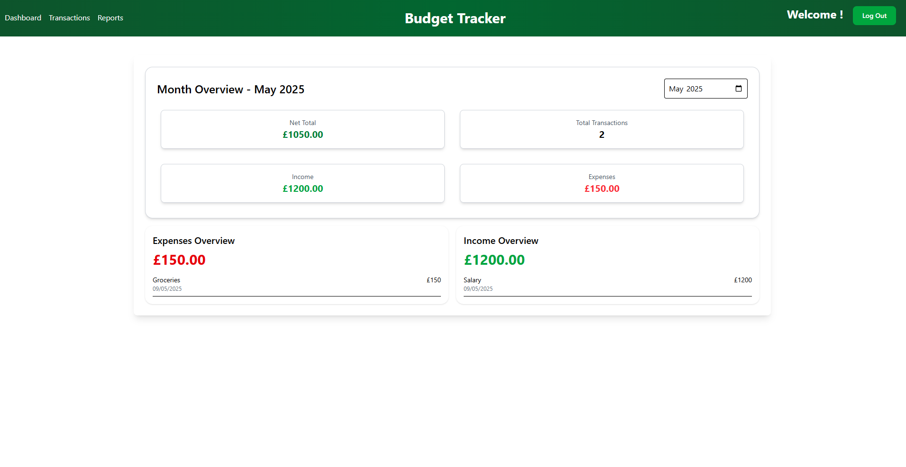
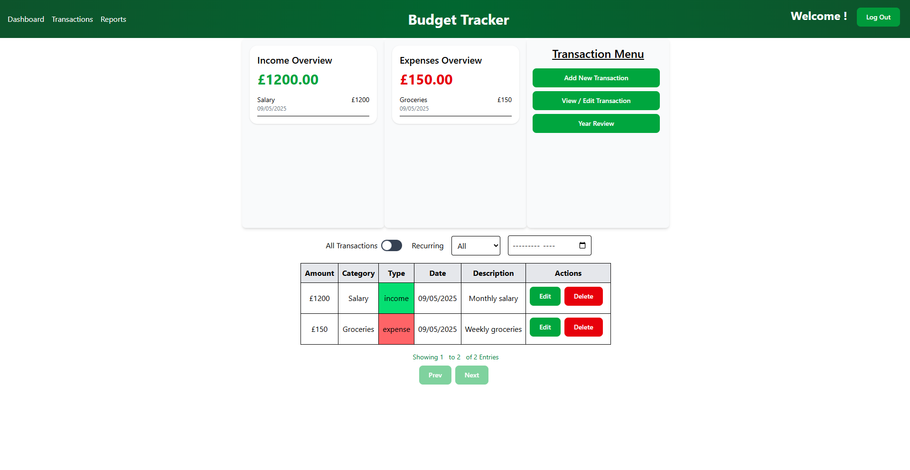

# 💰 Budget Tracker App

A full-stack MERN budget tracking website that allows users to manage their finances with ease. Create an account, track income and expenses, and visualize your financial health with insightful reports.

---
## ✨ Features

### 👤 User Accounts  
Sign up, log in, and manage your personal budget securely.

### ➕ Add / ✏️ Edit / ❌ Delete Transactions  
Track income and expenses with support for creating, editing, and removing entries.

### 📊 Reporting Dashboard  
Visual summary of spending and income — filter by category, date range.

### 🧩 Categorization  
Assign categories to transactions for better organization and analysis.

---

## 🛠 Tech Stack

- **React**
- **Node.js + Express**
- **MongoDB** for data persistence
- **JWT Authentication**
- **Tailwind CSS** for styling
